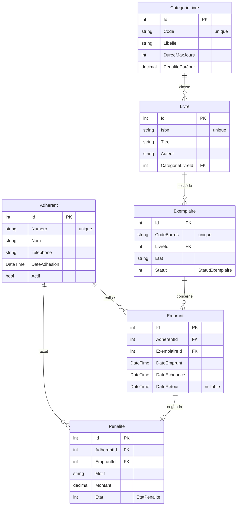

# BiblioPlus — Jalon 1 : Analyse et conception

Document de conception à valider **avant tout code** (cf. README, « Jalon 1 »).

---

## 1. Description du problème

Une **bibliothèque** souhaite gérer ses **exemplaires physiques**, les **emprunts**,
les **retours** et les **pénalités de retard**.

- Un **adhérent** peut emprunter des exemplaires de livres, dans la limite des règles métier.
- Chaque **livre** appartient à une **catégorie** qui définit la **durée maximale d'emprunt**
  et la **pénalité journalière** en cas de retard.
- Un **livre** peut posséder plusieurs **exemplaires** physiques ; c'est l'exemplaire
  (et non le livre) qui est effectivement emprunté.
- Un **emprunt** enregistre qui a emprunté quel exemplaire, quand, et jusqu'à quand
  (échéance calculée par le serveur). Le **retour** libère l'exemplaire.
- Un retour **en retard** génère une **pénalité** calculée à partir du tarif journalier
  de la catégorie.

Objectif logiciel : une solution en **architecture en couches** (Domain / Application /
Infrastructure / Web / Api) exposant un **CRUD MVC** du référentiel `CategorieLivre`
et une **API REST** couvrant le référentiel + le workflow de circulation.

---

## 2. Diagramme des entités et cardinalités



### Cardinalités (résumé)

| Relation | Cardinalité | Type |
|---|---|---|
| `CategorieLivre` → `Livre` | 1 — * | un-à-plusieurs |
| `Livre` → `Exemplaire` | 1 — * | un-à-plusieurs |
| `Adherent` → `Emprunt` | 1 — * | un-à-plusieurs (**transaction**) |
| `Exemplaire` → `Emprunt` | 1 — * | un-à-plusieurs (**transaction**) |
| `Adherent` → `Penalite` | 1 — * | un-à-plusieurs |
| `Emprunt` → `Penalite` | 1 — 0..1 | un-à-un optionnel |

> ✔️ Exigences du README couvertes : **≥ 3 relations un-à-plusieurs** (on en a 5),
> **≥ 1 relation « transaction / ligne de détail »** (l'`Emprunt`),
> **≥ 1 index unique pertinent** (`Code`, `Isbn`, `CodeBarres`, `Numero`).

---

## 3. Liste des enums

```csharp
public enum StatutExemplaire
{
    Disponible,
    Emprunte,
    Perdu,
    Endommage
}

public enum EtatPenalite
{
    ARegler,
    Reglee,
    Annulee
}
```

- `StatutExemplaire` : cycle de vie d'un exemplaire physique.
- `EtatPenalite` : cycle de vie d'une pénalité.

---

## 4. Règles métier numérotées

Workflow principal : `CirculationService.GererEmpruntAsync(...)`, de l'emprunt au retour.
Convention d'intervalle des périodes : `[début, fin[`.

1. **Éligibilité de l'adhérent (emprunt)** — l'adhérent est **actif**, ne possède
   **aucune pénalité non réglée** (`EtatPenalite.ARegler`) et n'a **pas plus de trois
   emprunts actifs** (emprunts sans date de retour).
2. **Disponibilité de l'exemplaire (emprunt)** — l'exemplaire est **`Disponible`**
   au moment de l'emprunt.
3. **Calcul de l'échéance (emprunt)** — le **serveur** calcule
   `DateEcheance = DateEmprunt + DureeMaxJours` de la **catégorie** du livre.
   Le client n'impose pas l'échéance.
4. **Retour et pénalité (retour)** — un retour **en retard** crée une **pénalité** égale au
   **nombre de jours commencés × `PenaliteParJour`** de la catégorie. Le retour **libère
   l'exemplaire** (`Statut → Disponible`) de manière **atomique** (une seule
   `SaveChangesAsync()` en fin de cas d'usage réussi).

> Codes HTTP visés en cas de refus métier / unicité / dépendance : **409 Conflict**.

---

## 5. Routes MVC et API envisagées

### 5.1 MVC — référentiel `CategorieLivre`

| Écran | But |
|---|---|
| Liste | lister les catégories |
| Détails | voir une catégorie |
| Création | créer une catégorie |
| Modification | éditer une catégorie |
| Suppression | **suppression logique** avec confirmation |

Règle : la suppression du référentiel est **refusée** s'il est encore utilisé par une
donnée métier active (livres rattachés). Le contrôleur MVC passe par `IUnitOfWork` /
un service applicatif — **jamais** EF Core directement.

### 5.2 API — référentiel `CategorieLivre`

```text
GET    /api/categories-livres
GET    /api/categories-livres/{id}
POST   /api/categories-livres
PUT    /api/categories-livres/{id}
DELETE /api/categories-livres/{id}
```

### 5.3 API — routes métier

```text
GET   /api/livres/disponibles?recherche=...
POST  /api/emprunts
POST  /api/emprunts/{id}/retour
PATCH /api/penalites/{id}/regler
```

Contraintes API : **DTO** de requête/réponse (jamais d'entité EF Core sérialisée),
codes `200 / 201 / 204 / 400 / 404 / 409`, `201 Created` + en-tête `Location` après
création, fichier `.http` reproductible, OpenAPI en développement.

---

## 6. Vérification des exigences du Jalon 1

- [x] Description du problème
- [x] Diagramme des entités et cardinalités
- [x] Liste des enums (2)
- [x] Règles métier numérotées (4)
- [x] Routes MVC et API envisagées

➡️ **Après validation** : `git init`, premier commit, puis `git tag checkpoint-1`.
